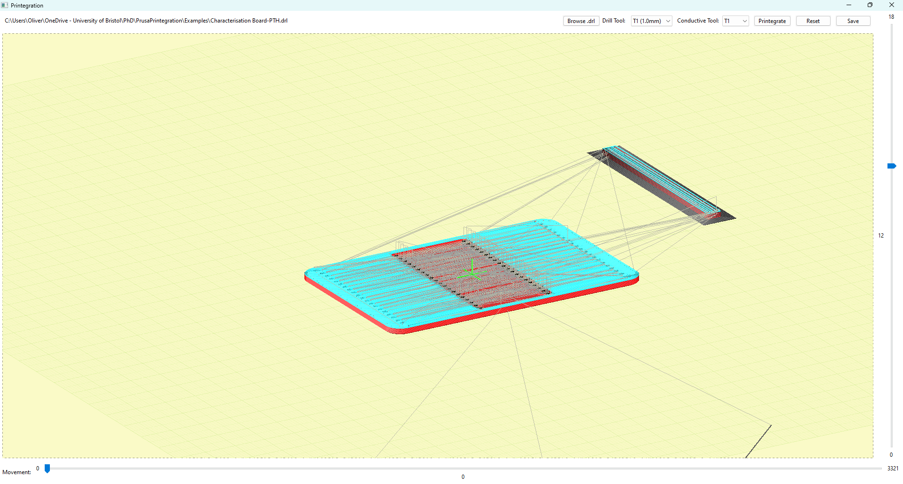

# PrusaPrintegration
> GCode post-processor for integrating PCBs into 3D prints

## Installation Windows
1. Clone the repository: `https://github.com/ollyoid/PrusaPrintegration.git`
2. Create a virtual environment: `python -m venv venv`
3. Activate the virtual environment: `.\venv\Scripts\activate`
4. Install dependencies: `pip install -r requirements.txt`
5. Import PrusaSlicer config `File>Import>Import Config...` and browse to porject directory to select `config.ini`
6. Enable "Expert mode" from top right corner
6. Set PrusaSlicer Post-Processing path `Print Settings>Output options>Post-processing scripts` to `printegration.bat` (Windows only for now)

## Installation Linux/MacOs
> [!WARNING]  
> This doesn't seem to be currently working with graphical elements not rendering properly
1. Clone the repository: `https://github.com/ollyoid/PrusaPrintegration.git`
2. Create a virtual environment: `python -m venv venv`
3. Activate the virtual environment `source ./venv/bin/activate`
4. (only on linux) Install wx python https://wxpython.org/pages/downloads/
5. Install remaining dependencies : `pip install -r requirements.txt`
6. Make the script executable: `chmod +x printegration.sh`
7. Import PrusaSlicer config `File>Import>Import Config...` and browse to porject directory to select `config.ini`
8. Enable "Expert mode" from top right corner
9. Set PrusaSlicer Post-Processing path `Print Settings>Output options>Post-processing scripts` to `printegration.sh` 

## Usage
1. Slice a multi-material print as you normally would in PrusaSlicer
2. When you click "Export G-code" a GUI window will open that allows you to slelct and postion a drill file relative to the print
3. When you click "Printegrate", _Prinjection_ movements will be added to the G-code to inject filament into the part
4. When you click "Save", the G-code will be exported to the location specified in PrusaSlicer

# TODO
- [ ] MacOS and Linux support
- [ ] Implement rotation of Drill markers
- [ ] Add support for multiple drill files
- [ ] Add support for different printers
- [ ] Reset button
- [ ] Turn on and drill marker points